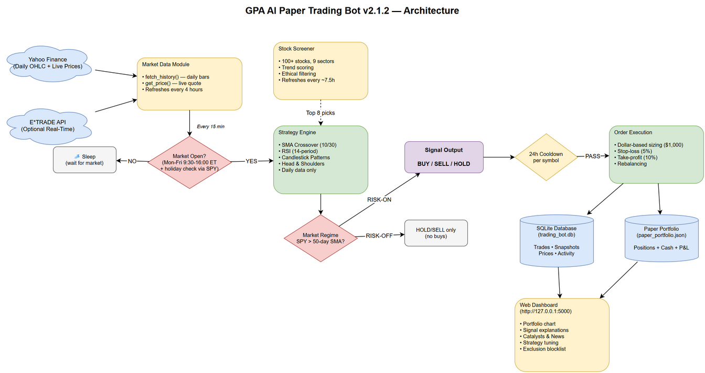

# AI Paper Trading Bot for E\*TRADE — v2.1.2

An AI-powered paper trading system that uses real market data from Yahoo Finance to simulate stock trading with technical analysis strategies. The bot combines SMA crossover, RSI momentum, and candlestick pattern detection (including Head \& Shoulders) to generate signals from daily chart data. It automatically screens and selects trending stocks from a diverse, ethically filtered universe — no seed money required.

**This is a paper trading tool for testing and education only. No real orders are placed.**

\---

## Architecture



---

## Table of Contents

* [Features](#features)
* [Project Structure](#project-structure)
* [Installation](#installation)
* [Quick Start](#quick-start)
* [Configuration Guide](#configuration-guide)

  * [Watchlist Mode](#watchlist-mode)
  * [Stock Screener](#stock-screener)
  * [Exclusion List](#exclusion-list)
  * [Per-Symbol Trade Limits](#per-symbol-trade-limits)
  * [Cooldown](#cooldown)
  * [Seed Portfolio](#seed-portfolio)
  * [Rebalancing](#rebalancing)
  * [Strategy Parameters](#strategy-parameters)
  * [Risk Management](#risk-management)
* [Code Architecture](#code-architecture)

  * [Market Data Module](#market-data-module)
  * [Strategy Module](#strategy-module)
  * [Stock Screener](#stock-screener-module)
  * [Paper Trading Portfolio](#paper-trading-portfolio)
  * [Trading Bot](#trading-bot-main-loop)
* [How the Strategy Works](#how-the-strategy-works)
* [How the Screener Works](#how-the-screener-works)
* [How Rebalancing Works](#how-rebalancing-works)
* [Ethical Filtering](#ethical-filtering)
* [Troubleshooting](#troubleshooting)
* [FAQ](#faq)
* [Disclaimer](#disclaimer)

\---

## Features

* **Real market prices** from Yahoo Finance — no API keys needed for price data
* **AI stock screener** that auto-selects trending stocks from 100+ candidates across 9 sectors
* **Ethical filtering** — The bot supports an optional category exclusion list that removes certain types of companies from the stock universe.
* **Sector diversity** — the screener ensures picks span multiple sectors (tech, healthcare, finance, energy, etc.)
* **SMA crossover + RSI strategy** for signal generation
* **Paper portfolio** with full P\&L tracking, persisted to disk
* **Rebalancing** — sells existing positions to fund new buys (no seed cash needed)
* **Stop-loss and take-profit** risk management
* **Per-symbol trade limits** and a global exclusion list to protect positions you manage manually
* **Dollar-based position sizing** — equal dollar exposure per trade regardless of share price
* **24-hour cooldown** per symbol to prevent overtrading on noise
* **Seed portfolio** support to mirror your real brokerage account
* **Periodic re-screening** to refresh stock picks as market conditions change
* **Candlestick pattern detection** — engulfing, hammer, shooting star, Head \& Shoulders, Inverse H\&S
* **Daily timeframe signals** — ignores intraday noise, uses only daily close data
* **Signal explanations** — click-to-expand plain-English breakdown of why BUY/SELL/HOLD
* **Catalysts \& News** — live news headlines with summaries and upcoming earnings dates
* **Tunable strategy** — adjust SMA, RSI, and sizing parameters from the dashboard in real-time
* **Market hours aware** — only trades when the market is open (detects holidays automatically)

\---

## Project Structure

```
etrade\_python\_client/
├── config.ini                  # E\*TRADE API keys (optional, for original client)
├── trading\_config.py           # All bot configuration in one place
├── trading\_bot.py              # Main entry point — the trading loop
├── run\_dashboard.py            # Web dashboard launcher (binds 0.0.0.0:5000)
├── test\_run.py                 # Single-cycle test script
├── test\_screener.py            # Screener-only test script
├── market/
│   ├── market.py               # Original E\*TRADE market quotes (interactive)
│   └── market\_data.py          # Yahoo Finance market data (used by bot)
├── strategy/
│   ├── indicators.py           # Technical indicators (SMA, EMA, RSI, MACD)
│   ├── signals.py              # Signal generator (BUY/SELL/HOLD)
│   └── screener.py             # Stock screener with ethical filtering
├── paper\_trading/
│   └── portfolio.py            # Simulated portfolio tracker
├── accounts/
│   └── accounts.py             # Original E\*TRADE account management
└── order/
    └── order.py                # Original E\*TRADE order placement

start\_trading\_bot.ps1            # Startup script (launches dashboard + starts trading)
register\_task.ps1                # Helper to register the Windows Scheduled Task
```

\---

## Installation

### Quick Install (Windows)

1. Copy the entire project folder to your new computer
2. Double-click `install.bat`

The installer will:

* Check that Python 3.10+ is installed
* Create a virtual environment and install dependencies
* Create a desktop shortcut with icon
* Set up auto-start on login (via Task Scheduler + Startup folder)

### Prerequisites

* Python 3.10 or higher (download from [python.org](https://www.python.org) — check "Add Python to PATH")

### Manual Install

1. Clone or download this repository
2. Install dependencies:

```bash
pip install -r requirements.txt
```

This installs:

* `pandas` — data manipulation and time series
* `numpy` — numerical computing
* `yfinance` — Yahoo Finance market data API
* `rauth` — OAuth library (for the original E\*TRADE client, not needed for paper trading)
3. Verify installation:

```bash
cd etrade\_python\_client
python test\_screener.py
```

You should see a table of trending stocks ranked by score.

\---

## Quick Start

### Run the screener test (no trading, just see what the AI picks):

```bash
cd etrade\_python\_client
python test\_screener.py
```

### Run a single trading cycle (one-shot test):

```bash
cd etrade\_python\_client
python test\_run.py
```

### Run the full trading bot (continuous loop):

```bash
cd etrade\_python\_client
python trading\_bot.py
```

Press `Ctrl+C` to stop. The bot saves its state to `paper\_portfolio.json` and will resume where it left off on the next run.

\---

## Web Dashboard

The bot includes a web dashboard at `http://127.0.0.1:5000` with:

* **Portfolio Value Trend** — chart with 1D/1W/1M/3M/YTD/1Y/ALL time ranges
* **Positions Table** — live prices, P\&L, signals, candlestick patterns, dollar-based trade limits
* **Signal Explanations** — click ▶ next to any signal for a plain-English breakdown (SMA trend, RSI level, candle patterns detected)
* **Candlestick Patterns** — displayed under each signal (Engulfing, Hammer, H\&S, etc.)
* **Catalysts \& News** — recent headlines with expandable summaries and links to full articles, plus upcoming earnings dates
* **Strategy Settings** — tune SMA windows, RSI thresholds, trade amount, and cooldown in real-time
* **Start/Stop Toggle** — single button that changes color based on bot state
* **Collapsible panels** — click any panel header to collapse/expand
* **Market Regime Filter** — blocks all buys when SPY is below its 50-day SMA (risk-off mode)
* **Market Closed banner** — bold indicator when market is closed (evenings, weekends, holidays) with countdown to next open/close

Launch the dashboard:

```bash
cd etrade\_python\_client
python run\_dashboard.py
```

### LAN Access

The dashboard binds to `0.0.0.0:5000`, making it accessible from any device on your local network at `http://<your-PC-IP>:5000`. A Windows Firewall rule ("Trading Bot Dashboard") allows inbound TCP on port 5000.

### Auto-Start on Reboot

A Windows Scheduled Task (`GPA_TradingBot_AutoStart`) launches the dashboard and automatically starts trading when the system boots — no manual "Start" click required.

\---

## Configuration Guide

All configuration lives in `trading\_config.py`. Edit this file to customize the bot's behavior.

### Watchlist Mode

```python
WATCHLIST\_MODE = "screener"   # "screener" or "static"
```

* `"screener"` — The bot automatically selects trending stocks from a diverse universe of 100+ stocks. This is the recommended mode.
* `"static"` — The bot only trades the symbols listed in `WATCHLIST`.

### Stock Screener

```python
SCREENER\_TOP\_N = 8            # number of stocks to pick
SCREENER\_SMA\_PERIOD = 50      # SMA period for trend scoring
SCREENER\_MIN\_VOLUME = 500\_000 # minimum average daily volume
SCREENER\_HISTORY = "3mo"      # look-back period
SCREENER\_RERUN\_CYCLES = 30    # re-screen every N cycles
SCREENER\_SECTORS = None       # None = all sectors
```

To limit to specific sectors:

```python
SCREENER\_SECTORS = \["tech", "healthcare", "finance"]
```

Available sectors: `tech`, `healthcare`, `consumer`, `finance`, `energy`, `industrials`, `communication`, `real\_estate`, `materials`

### Exclusion List

```python
EXCLUDED\_SYMBOLS = \["RIVN", "LCID"]
```

Tickers in this list are completely untouchable — the bot will never buy or sell them, even if they appear in the watchlist or screener results. Use this to protect positions you manage manually.

Note: Weapons and defense stocks are excluded separately via a hardcoded blocklist in `strategy/screener.py`. You do not need to add them to `EXCLUDED\_SYMBOLS`.

### Per-Symbol Trade Limits

```python
TRADE\_DOLLAR\_AMOUNT = 1000  # $1,000 per trade (shares calculated from price)

SYMBOL\_LIMITS = {
    "QS": {"max\_buy": 500, "max\_sell": 1000},   # dollar amounts
}
```

The bot sizes all trades in dollar amounts. Each trade targets `TRADE\_DOLLAR\_AMOUNT` worth of shares (rounded down to whole shares). Per-symbol overrides in `SYMBOL\_LIMITS` are also dollar amounts. Global caps:

```python
MAX\_POSITION\_SIZE = 100     # max total shares in any single symbol
MAX\_PORTFOLIO\_PCT = 0.15    # max 15% of portfolio value in one position
```

### Cooldown

```python
COOLDOWN\_HOURS = 24         # hours to wait before re-trading same symbol
```

After any trade (buy or sell) on a symbol, the bot will not trade that symbol again for 24 hours. This prevents overtrading on noisy intraday signals.

### Seed Portfolio

```python
STARTING\_CASH = 0.00   # start with $0 — fund buys by selling

SEED\_POSITIONS = {
    "AAPL": {"qty": 50, "avg\_cost": 170.00},
    "MSFT": {"qty": 20, "avg\_cost": 380.00},
}
```

Seed positions are loaded on the first run only (when no `paper\_portfolio.json` exists). After that, state is persisted and the seed is ignored. To reset, delete `paper\_portfolio.json`.

### Rebalancing

```python
ENABLE\_REBALANCE = True
REBALANCE\_SELL\_PRIORITY = "weakest\_signal"
```

When the bot gets a BUY signal but has no cash, it sells shares from existing positions to raise funds. Priority options:

|Priority|Behavior|
|-|-|
|`"weakest\_signal"`|Sell positions with SELL signals first, then HOLD. Never sell positions with BUY signals.|
|`"largest\_loss"`|Sell the position with the biggest unrealized loss first.|
|`"largest\_value"`|Sell the position with the highest market value first.|

### Strategy Parameters

```python
SHORT\_SMA\_WINDOW = 10    # fast moving average
LONG\_SMA\_WINDOW = 30     # slow moving average
RSI\_PERIOD = 14          # RSI look-back
RSI\_OVERBOUGHT = 70.0    # sell threshold
RSI\_OVERSOLD = 30.0      # informational
```

### Risk Management

```python
STOP\_LOSS\_PCT = 0.05     # sell if down 5% from avg cost
TAKE\_PROFIT\_PCT = 0.10   # sell if up 10% from avg cost
ENABLE\_STOP\_LOSS = True
ENABLE\_TAKE\_PROFIT = True
```

### Market Regime Filter

```python
ENABLE\_MARKET\_REGIME = True
REGIME\_BENCHMARK = "SPY"       # ETF to gauge market health
REGIME\_SMA\_PERIOD = 50         # SPY must be above its 50-day SMA to allow buys
```

When enabled, the bot checks if SPY is above its 50-day SMA before allowing any BUY signals. If SPY is below (market in downtrend), all buys are suppressed — the bot will only HOLD or SELL. This prevents buying into a falling market where macro selling pressure drags down even strong stocks.

\---

## Code Architecture

### Market Data Module

**File:** `market/market\_data.py`

The `MarketData` class wraps Yahoo Finance to provide:

* `get\_quote(symbol)` — Fetches a real-time quote with price, bid, ask, volume, and change data
* `get\_price(symbol)` — Returns just the last trade price
* `fetch\_history(symbol, period, interval)` — Downloads historical closing prices and stores them in memory. This seeds the strategy so signals can fire on the first cycle
* `get\_price\_history(symbol)` — Returns the full price series as a pandas Series

The module maintains an in-memory price history per symbol. Historical daily data is fetched at startup and refreshed every \~4 hours. Signal generation uses only daily close data to avoid intraday noise. Live prices (polled every 15 minutes) are used only for stop-loss/take-profit checks and portfolio valuation.

### Strategy Module

**File:** `strategy/indicators.py`

Pure functions for technical indicator calculation:

* `sma(series, period)` — Simple Moving Average
* `ema(series, period)` — Exponential Moving Average
* `rsi(series, period)` — Relative Strength Index (0-100)
* `macd(series, fast, slow, signal)` — MACD line, signal line, and histogram

All functions accept a pandas Series and return a pandas Series.

**File:** `strategy/signals.py`

The `SignalGenerator` class combines SMA crossover, RSI, and candlestick pattern detection to produce trading signals:

* **BUY** when the short SMA crosses above the long SMA AND RSI is below the overbought threshold, confirmed by bullish candlestick patterns
* **SELL** when the short SMA crosses below the long SMA OR RSI exceeds the overbought threshold, confirmed by bearish candlestick patterns
* **HOLD** otherwise

**Candlestick patterns detected:**

* Bullish Engulfing, Hammer → confirm BUY signals
* Bearish Engulfing, Shooting Star → confirm SELL signals
* Head and Shoulders → bearish reversal, triggers SELL
* Inverse Head and Shoulders → bullish reversal, triggers BUY
* Doji → indecision, logged for awareness

The generator requires at least `long\_window + 1` data points before producing signals. All signals are based on daily close data only (not intraday).

### Stock Screener Module

**File:** `strategy/screener.py`

The `StockScreener` class:

1. Maintains a universe of 100+ stocks across 9 sectors
2. Filters out weapons/defense stocks via a hardcoded blocklist
3. Downloads 3 months of daily data for all candidates
4. Scores each stock by trend strength: `(price/SMA - 1) \* 100 + RSI\_bonus`
5. Applies sector diversity rules (max 2 per sector by default)
6. Returns the top N candidates

### Paper Trading Portfolio

**File:** `paper\_trading/portfolio.py`

The `PaperPortfolio` class simulates a brokerage account:

* `buy(symbol, qty, price)` — Simulates a buy order, deducts cash, updates position with weighted average cost
* `sell(symbol, qty, price)` — Simulates a sell order, adds cash, removes position if fully sold
* `summary(current\_prices)` — Returns a formatted string with cash, positions, market values, and P\&L
* State is persisted to `paper\_portfolio.json` after every trade
* Supports seed positions for mirroring a real account

### Trading Bot Main Loop

**File:** `trading\_bot.py`

The main loop runs in four phases each cycle:

1. **Collect** — Fetch live prices and generate signals for all tradeable symbols
2. **Risk management** — Check stop-loss and take-profit for existing positions
3. **Sell** — Execute all SELL signals first (frees up cash)
4. **Buy** — Execute BUY signals using available cash, or rebalance if needed

The bot also periodically re-runs the screener (every `SCREENER\_RERUN\_CYCLES` cycles) to refresh its stock picks.

\---

## How the Strategy Works

The bot uses a **multi-indicator momentum strategy**:

```
SMA Crossover (trend direction)
  + RSI (momentum strength)
  + Candlestick Patterns (confirmation \& reversal detection)
  = Trading Signal
```

**SMA Crossover:**

* When the 10-day SMA crosses ABOVE the 30-day SMA, the short-term trend is accelerating — potential BUY
* When the 10-day SMA crosses BELOW the 30-day SMA, momentum is fading — potential SELL

**RSI Filter:**

* RSI > 70 = overbought → triggers SELL regardless of SMA
* RSI < 70 during an upward crossover → confirms BUY
* This prevents buying into overextended rallies

**Candlestick Pattern Confirmation:**

* **Bullish Engulfing / Hammer** — confirms BUY in an uptrend or near oversold levels
* **Bearish Engulfing / Shooting Star** — confirms SELL in a downtrend
* **Head and Shoulders** — classic bearish reversal pattern (3 peaks, middle highest, price breaks neckline) → triggers SELL
* **Inverse Head and Shoulders** — bullish reversal (3 troughs, middle lowest, price breaks neckline) → triggers BUY

**Timeframe Discipline:**

* Signals are generated from **daily close data only** (not intraday)
* The 15-minute polling interval is used only for stop-loss/take-profit monitoring
* Daily bars are refreshed every \~4 hours to capture the latest close
* This prevents the bot from reacting to intraday noise

**Why this combination?**
SMA crossover alone generates too many false signals in choppy markets. RSI acts as a momentum filter, and candlestick patterns provide visual confirmation of reversals. Head and Shoulders detection catches major trend changes that simple moving averages miss. All signals use daily timeframes suitable for swing trading.

\---

## How the Screener Works

The screener scores stocks using a **trend strength formula**:

```
trend\_score = (price / SMA\_50 - 1) × 100 + RSI\_bonus
```

**RSI Bonus:**

|RSI Range|Bonus|Reasoning|
|-|-|-|
|40–70|+10|Sweet spot: strong trend, not overbought|
|30–40|+5|Oversold, potential bounce|
|> 70|-5|Overbought, risky entry|
|< 30|-10|Deeply oversold, avoid|

**Diversity enforcement:**

* Maximum 2 stocks per sector in the final picks
* Remaining slots filled by next-best from any sector
* This prevents the portfolio from being 100% tech stocks

\---

## How Rebalancing Works

When `ENABLE\_REBALANCE = True` and `STARTING\_CASH = 0.00`:

1. Bot gets a BUY signal for Stock A but has no cash
2. Bot looks at existing positions for something to sell
3. Using `REBALANCE\_SELL\_PRIORITY`, it ranks candidates:

   * Positions with SELL signals are sold first
   * Positions with HOLD signals are sold next
   * Positions with BUY signals are never sold for rebalancing
4. Bot sells just enough shares to cover the buy
5. Bot executes the buy with the freed-up cash

This allows the portfolio to rotate into stronger trends without needing external cash.

\---

## Ethical Filtering (Optional)

The bot supports an optional category exclusion list that removes certain types of companies from the stock universe. By default, weapons and military-related stocks are excluded (defense contractors, weapons manufacturers, ammunition producers, military technology, and military surveillance companies).

You can customize this by editing the blocklist in `strategy/screener.py` under `WEAPONS\_DEFENSE\_BLOCKLIST` — add or remove tickers and categories to match your preferences.

\---

## Troubleshooting

### "No module named 'market'" or similar import errors

The bot must be run from inside the `etrade\_python\_client/` directory:

```bash
cd etrade\_python\_client
python trading\_bot.py
```

### "No price data found, symbol may be delisted"

Yahoo Finance occasionally reports this for valid tickers during off-hours or for recently changed symbols. The screener skips these automatically. If a specific ticker consistently fails, it may have been delisted or renamed — remove it from the universe in `strategy/screener.py`.

### Portfolio state is stale or corrupted

Delete the state file to start fresh:

```bash
rm paper\_portfolio.json    # Linux/Mac
del paper\_portfolio.json   # Windows
```

The bot will re-create it using `SEED\_POSITIONS` and `STARTING\_CASH` from `trading\_config.py`.

### Bot shows "HOLD" for everything

This is normal when:

* The market is in a sideways/consolidation phase
* RSI is in the neutral zone (40-60) and no SMA crossover is happening
* You just started and the bot is collecting price data

The strategy is intentionally conservative. It waits for clear trend signals rather than trading on noise.

### Yahoo Finance rate limiting

If you see frequent "Quote request failed" errors, increase `POLL\_INTERVAL\_SEC` in `trading\_config.py`. Yahoo Finance has unofficial rate limits — 15 minutes between polls (the default) is very safe. For the screener, data is fetched in batches of 20 to reduce API calls.

### Bot does not buy anything (no cash, no rebalancing)

Check that:

1. `ENABLE\_REBALANCE = True` in `trading\_config.py`
2. You have seed positions (`SEED\_POSITIONS`) or starting cash (`STARTING\_CASH`)
3. The positions you hold are not all in `EXCLUDED\_SYMBOLS`
4. At least one held position has a SELL or HOLD signal (BUY-signal positions are never sold for rebalancing)

### Screener returns fewer stocks than SCREENER\_TOP\_N

This happens when:

* Many stocks fail the minimum volume filter
* Sector diversity rules limit picks (max 2 per sector)
* Some tickers fail to download from Yahoo Finance

Try increasing `SCREENER\_TOP\_N` or lowering `SCREENER\_MIN\_VOLUME`.

### Stop-loss or take-profit fires unexpectedly

These are based on the difference between the current price and your `avg\_cost`. If you seeded positions with an `avg\_cost` far from the current market price, triggers may fire immediately. Adjust `STOP\_LOSS\_PCT` and `TAKE\_PROFIT\_PCT` or set `ENABLE\_STOP\_LOSS = False` temporarily.

### Log file grows too large

The bot uses a rotating log file (`python\_client.log`) capped at 5 MB with 3 backups. If you need to clear it:

```bash
rm python\_client.log\*
```

\---

## FAQ

**Q: Does this place real trades?**
No. All trades are simulated in a local JSON file (`paper\_portfolio.json`). No connection to any brokerage is made during paper trading.

**Q: Do I need E\*TRADE API keys?**
Not for paper trading. The bot uses Yahoo Finance for price data. E\*TRADE keys are only needed if you use the original `etrade\_python\_client.py` interactive client.

**Q: Can I use this with a different broker?**
The paper trading system is broker-independent. It only needs price data (from Yahoo Finance). The original E\*TRADE modules (`accounts/`, `order/`, `market/market.py`) are separate and not used by the paper trading bot.

**Q: How often does the screener refresh?**
Every `SCREENER\_RERUN\_CYCLES` cycles (default: 30). At 15-minute intervals, that is roughly every 7.5 hours.

**Q: Can I add my own stocks to the universe?**
Yes. Edit `STOCK\_UNIVERSE` in `strategy/screener.py` and add tickers to the appropriate sector list.

**Q: What happens when the market is closed?**
The bot automatically detects when the market is closed (evenings, weekends, and federal holidays) and skips all trading activity. It verifies market status by checking if SPY has traded today — no hardcoded holiday calendar needed. The bot stays running and resumes trading when the market reopens.

\---

## Disclaimer

This software is for **educational and testing purposes only**. It does not constitute financial advice. Past performance of any trading strategy does not guarantee future results. The authors are not responsible for any financial losses incurred from using this software or applying its strategies to real trading. Always consult a qualified financial advisor before making investment decisions.

